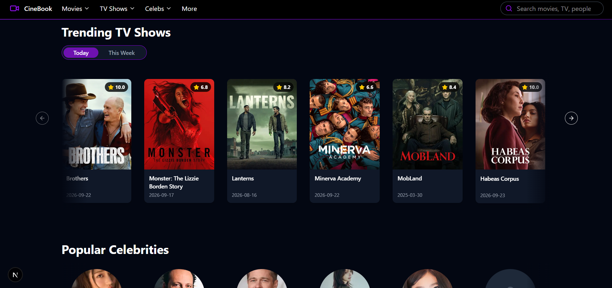
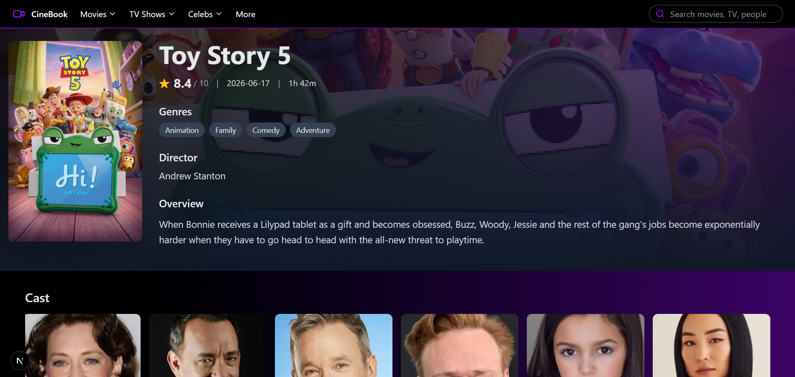
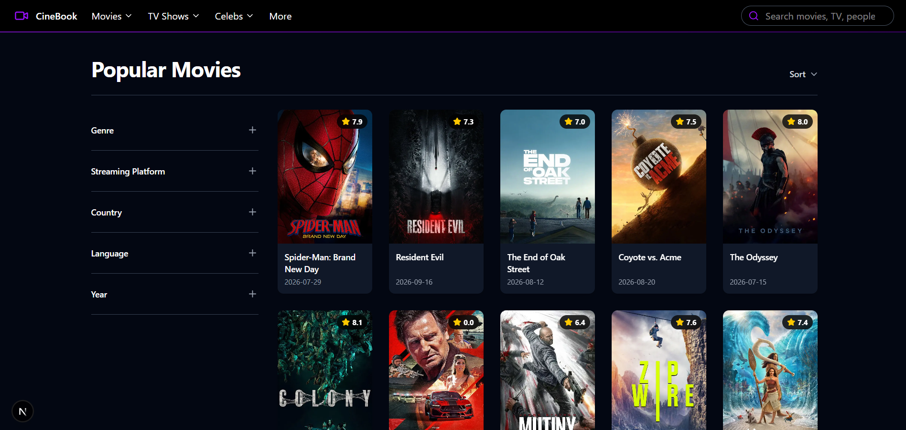
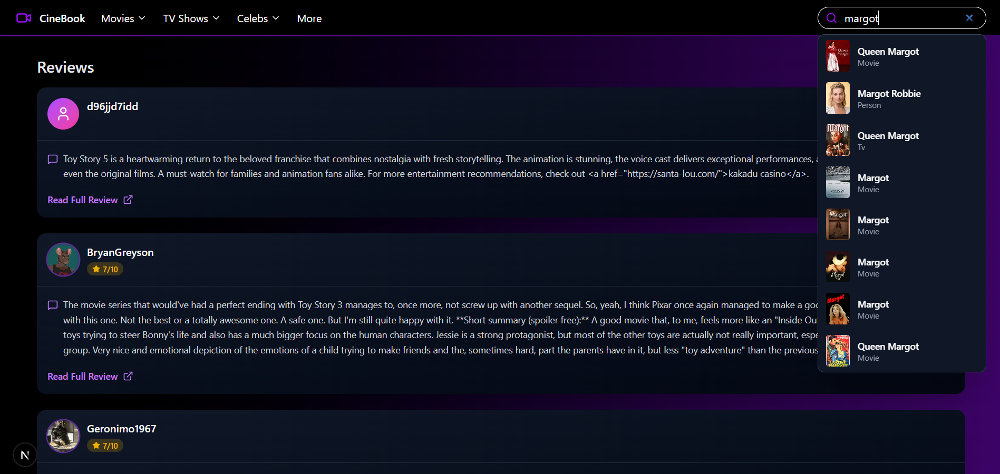

# CineBook

CineBook is a Next.js movie and TV discovery application powered by the TMDB API. Browse popular and trending movies, TV shows, and celebrities, then open detailed pages with cast, trailers, reviews, similar content, and search results.

## Features

- Trending movies, TV shows, trailers, celebrities, and reviews on the homepage
- Movie and TV show detail pages
- Popular, top-rated, upcoming, now-playing, airing-today, and on-the-air listings
- Movie and TV filters for genre, streaming platform, country, language, year, and sorting
- Celebrity detail pages with biography and known-for titles
- Full review pages with return navigation to the source page
- TMDB multi-search for movies, TV shows, and people
- Responsive carousels with keyboard navigation and edge fade effects

## Tech Stack

- Next.js 16 with the App Router
- React 19
- TypeScript
- Tailwind CSS 4
- TMDB API
- Embla Carousel
- Headless UI and Heroicons
- Lucide React

## Requirements

- Node.js 20 or newer
- A TMDB API read access token

## Getting Started

Install dependencies:

```bash
npm install
```

Start the development server:

```bash
npm run dev
```

Open [http://localhost:3000](http://localhost:3000) in your browser.

## Available Scripts

```bash
npm run dev      # Start the development server
npm run build    # Create a production build
npm run start    # Start the production server
npm run lint     # Run ESLint
```

## Project Structure

```text
app/
  components/       Shared application components
  celebs/           Celebrity listing and detail pages
  movies/           Movie listing and detail pages
  tv/               TV listing and detail pages
  reviews/          Full review pages
  lib/api.ts        TMDB request helper
  types/tmdb.ts     TMDB domain types
components/ui/      Reusable UI primitives such as tabs and carousels
public/images/      Local project images served from /images/* (.png)
app/public/icons/   Existing application icon assets
```

## Project Images

The project screenshots are stored in `public/images/` and can be previewed here:









## TMDB API

The application uses TMDB endpoints for movie, TV, celebrity, video, review, and search data. API requests are centralized through `app/lib/api.ts`.

For production usage, keep the TMDB token server-side or move it to an environment variable and expose data through server-side API routes. Do not commit private API credentials to the repository.

## Validation

Before opening a pull request, run:

```bash
npm run lint
npm run build
```

## License

This project is private and intended for development and learning purposes.

TMDB content and images are provided by [The Movie Database](https://www.themoviedb.org/).
